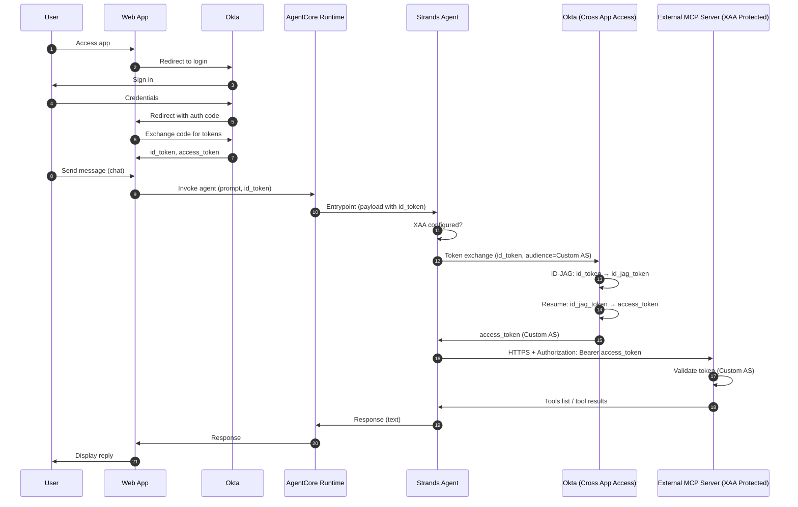

# Sequence Diagram: Agent → Okta XAA–Protected MCP Server (Direct)

Agent calls the MCP server **directly** (no Gateway). The agent performs Cross-App Access (XAA) to exchange the user's ID token for an auth-server access token before calling MCP.

