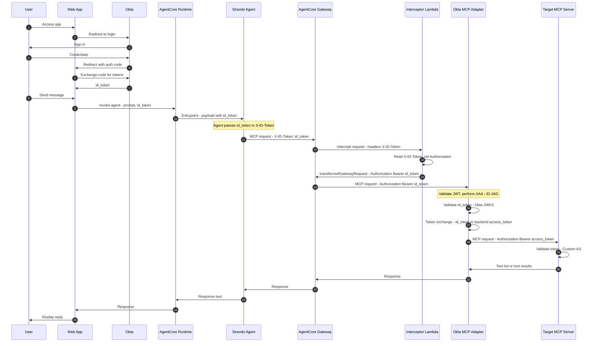

# Sequence Diagram: Agent → Okta XAA–Protected MCP via AgentCore Gateway + Okta MCP Adapter

Agent reaches the MCP server **through** an AgentCore Gateway, then the **Okta MCP Adapter** proxy. The Gateway does not forward the client `Authorization` header; a **Lambda interceptor** reads the token from an allowlisted header (e.g. `X-ID-Token`) and adds `Authorization: Bearer <token>` so the Gateway forwards the request to the **Okta MCP Adapter**. The adapter validates the incoming id token, performs **XAA (ID-JAG)** at the proxy layer, and forwards the request to the **target MCP server** with the backend access token. See [Okta MCP Adapter architecture](https://github.com/indranilokg/okta-agent-mcp-adapter/blob/main/docs/ARCHITECTURE_DIAGRAM.md).

