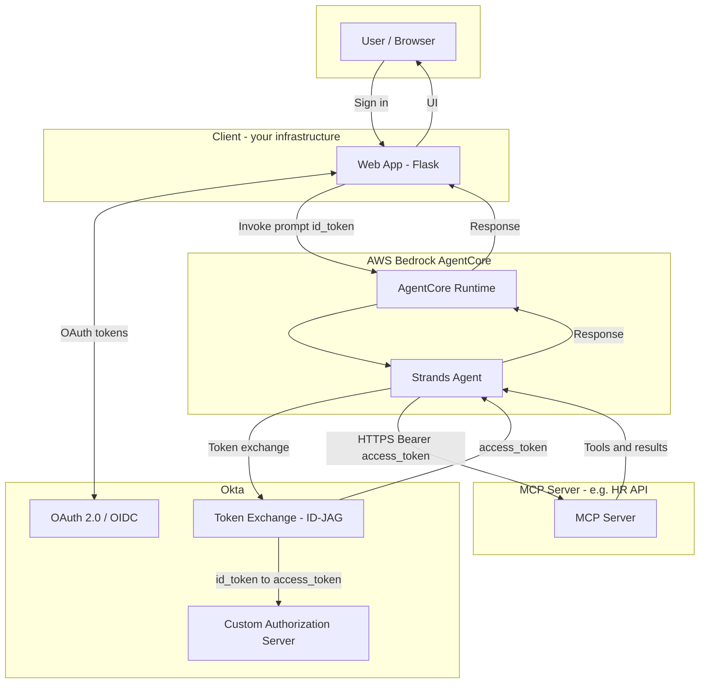

# Architecture: Direct Agent → Okta XAA–Protected MCP Server

The agent runs inside AgentCore Runtime and calls the MCP server over HTTPS with no Gateway. Authentication to the MCP server uses Okta Cross-App Access (XAA): the agent exchanges the user's ID token for an access token issued by the custom authorization server that protects the MCP API.

## Components

| Component | Role |
|-----------|------|
| **Web App** | Okta OAuth login; sends user message and `id_token` to AgentCore. |
| **AgentCore Runtime** | Hosts the Strands agent; passes payload (e.g. `id_token`) to the agent. |
| **Strands Agent** | Runs XAA (ID-JAG) via Okta SDK; calls MCP with `Authorization: Bearer <access_token>`. |
| **Okta Token Exchange** | Org AS: id_token → ID-JAG token; Custom AS: ID-JAG → access_token. |
| **MCP Server** | Protected by Custom AS; validates `Authorization: Bearer` access token. |
