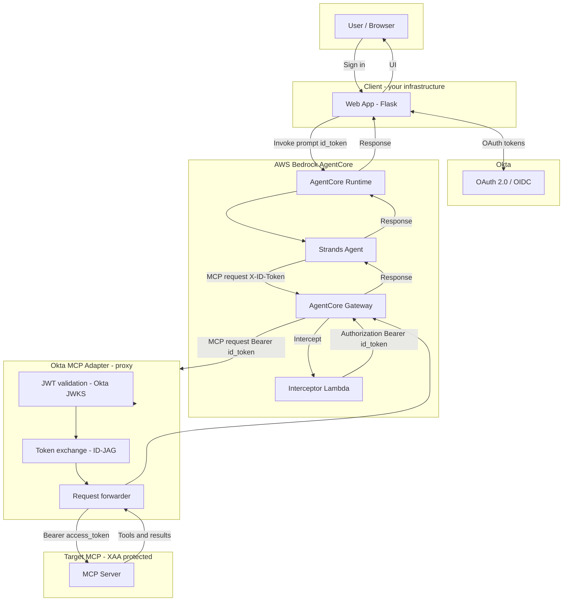

# Architecture: Agent → MCP via AgentCore Gateway + Okta MCP Adapter

The agent connects to the MCP server **through** an AgentCore Gateway and then the **Okta MCP Adapter** proxy. The Gateway does not forward the client's `Authorization` header; a **Lambda interceptor** adds it from an allowlisted header (e.g. `X-ID-Token`) so the Gateway can forward the request to the **Okta MCP Adapter**. The adapter validates the incoming id token, performs **XAA (ID-JAG)** at the proxy layer, and forwards to the **target MCP server** with the backend access token. Full adapter architecture: [Okta MCP Adapter — ARCHITECTURE_DIAGRAM.md](https://github.com/indranilokg/okta-agent-mcp-adapter/blob/main/docs/ARCHITECTURE_DIAGRAM.md).

## Components

| Component | Role |
|-----------|------|
| **Web App** | Okta OAuth; invokes AgentCore with user message and `id_token`. |
| **AgentCore Runtime** | Hosts the Strands agent. |
| **Strands Agent** | Sends MCP requests to **Gateway** with id_token in allowlisted header (e.g. `X-ID-Token`). No XAA in agent; adapter performs it. |
| **AgentCore Gateway** | Proxies MCP traffic to the **Okta MCP Adapter**; does not forward client `Authorization`; invokes interceptor. |
| **Interceptor Lambda** | Reads token from request headers; returns `Authorization: Bearer <token>` so Gateway forwards it to the adapter. |
| **Okta MCP Adapter** | Proxy that validates the incoming id token (Okta JWKS), performs **XAA (ID-JAG)** to obtain backend access token, caches tokens, and forwards requests to the target MCP with `Authorization: Bearer <access_token>`. See [Okta MCP Adapter architecture](https://github.com/indranilokg/okta-agent-mcp-adapter/blob/main/docs/ARCHITECTURE_DIAGRAM.md). |
| **Target MCP Server** | Backend MCP protected by Okta Custom AS; validates the access token issued by the adapter’s XAA exchange. |
