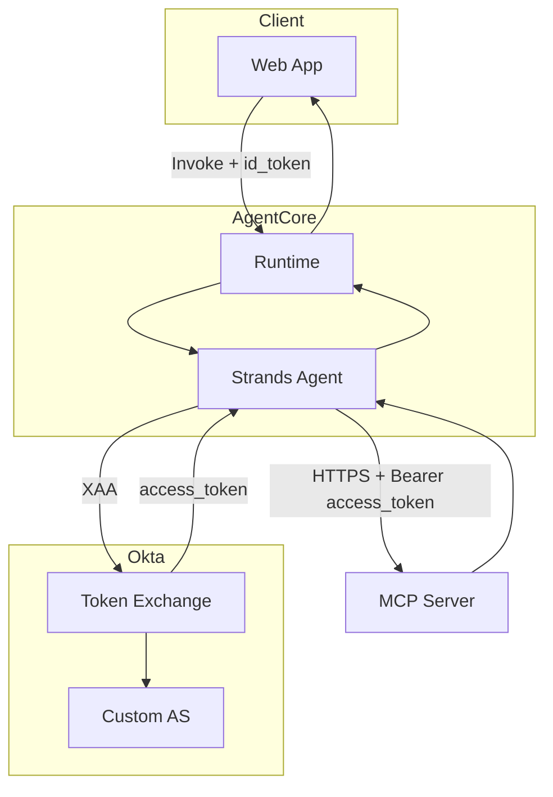
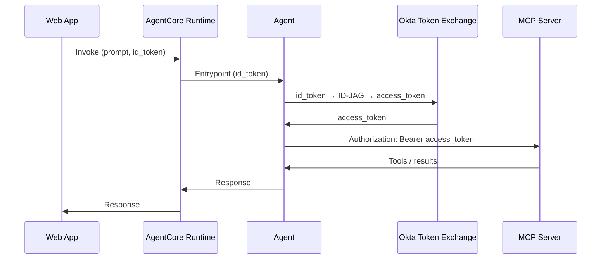
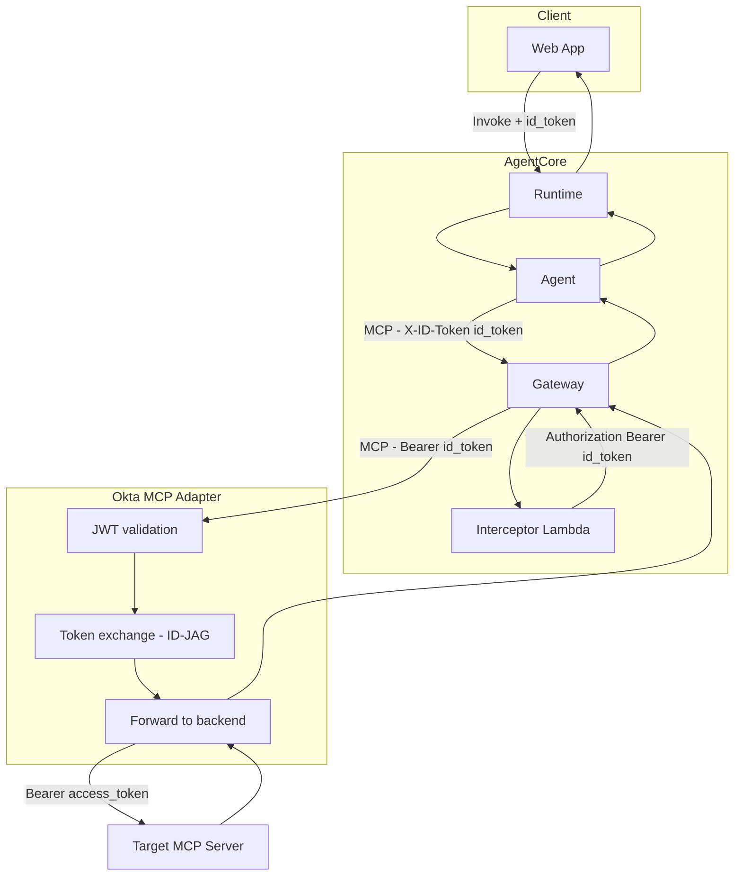

# Secure AgentCore Agents with Okta for AI Agents

**Two integration approaches for connecting an agent to an Okta Cross-App Access (XAA) protected MCP server.**

This whitepaper describes two ways to authenticate an AWS Bedrock AgentCore–hosted Strands agent to an MCP server protected by Okta (including XAA / custom authorization server): (1) **direct** agent-to-MCP calls with in-agent XAA, and (2) **Gateway** with a Lambda interceptor that injects the `Authorization` header for MCP targets.

---

## 1. Overview

- **AgentCore Runtime** runs your Strands agent. The runtime receives invocations (e.g. from a web app) with a user prompt and an Okta-issued **id_token**.
- The **MCP server** (e.g. HR API) is protected by Okta and may require an **access token** from a **custom authorization server** (Cross-App Access / ID-JAG), not the org-issued id_token.
- **Challenge:** The agent must call MCP with a valid `Authorization: Bearer <token>`. That token may be the result of an XAA token exchange (id_token → ID-JAG → access_token) or, in the Gateway path, the token is sent to the **Okta MCP Adapter**, which validates it and performs XAA before forwarding to the target MCP.

The two approaches differ in **how** the token reaches the MCP server:

| Approach | Agent → MCP path | How MCP gets `Authorization` |
|----------|------------------|------------------------------|
| **1. Direct** | Agent → MCP server (HTTPS) | Agent performs XAA and sends `Authorization: Bearer <access_token>` directly. |
| **2. Gateway + Okta MCP Adapter** | Agent → Gateway → (Interceptor) → **Okta MCP Adapter** → Target MCP | Agent sends id_token in allowlisted header (e.g. `X-ID-Token`); Lambda interceptor adds `Authorization`; Gateway forwards to **Okta MCP Adapter**; adapter validates id token, performs **XAA (ID-JAG)** at the proxy, then forwards to target MCP with backend access_token. |

---

## 2. Approach 1: Direct Agent → Okta XAA–Protected MCP Server

The agent connects to the MCP server **directly** (no Gateway). It uses the user’s **id_token** to perform Okta **Cross-App Access (XAA)** and obtains an **access_token** from the custom authorization server, then calls MCP with `Authorization: Bearer <access_token>`.

### 2.1 Architecture (1A)



### 2.2 Sequence (1)



### 2.3 Key implementation details

- **No Gateway:** The agent uses `HR_MCP_SERVER_URL` to the MCP server’s base URL and opens a streamable HTTP transport to it with an `httpx` client that sets `Authorization: Bearer <token>`.
- **Token resolution:** If XAA is configured (`XAA_OKTA_DOMAIN`, `XAA_PRINCIPAL_ID`, `XAA_AUTHORIZATION_SERVER_ID`, `XAA_PRIVATE_JWK`), the agent calls the Okta SDK’s Cross-App Access flow: `flow.start(token=id_token, audience=target_issuer, scope=..., token_type="id_token")`, then `flow.resume()` to get the custom AS access token. Otherwise the agent uses the id_token as the bearer token.
- **MCP only when URL is set:** If `HR_MCP_SERVER_URL` is not set, the agent runs with static tools only (no XAA, no MCP). When set, the agent resolves the bearer token (XAA or id_token), connects to MCP, merges tools, and runs.

**Relevant code (token resolution and direct MCP transport):**

```python
# Resolve bearer token: XAA if configured, else id_token
def _get_mcp_bearer_token(id_token: str) -> str:
    if not _is_xaa_configured():
        return id_token
    return get_mcp_token_via_xaa(id_token)  # ID-JAG then resume → access_token

# Direct HTTPS to MCP with Authorization header
async def _transport_with_auth(mcp_url: str, token: str):
    headers = {"Authorization": f"Bearer {token}"}
    async with httpx.AsyncClient(headers=headers, ...) as client:
        async with streamable_http_client(mcp_url, http_client=client) as streams:
            yield streams
```

---

## 3. Approach 2: Agent → MCP via AgentCore Gateway + Okta MCP Adapter

The agent connects to the MCP server **through** an **AgentCore Gateway** and then the **Okta MCP Adapter** proxy. The Gateway does **not** forward the client's `Authorization` header; a **Lambda interceptor** adds it from an allowlisted header (e.g. `X-ID-Token`) so the Gateway can forward the request to the **Okta MCP Adapter**. The adapter validates the incoming **id token** (Okta JWKS), performs **XAA (ID-JAG)** at the proxy layer—issuing and exchanging the ID-JAG token for a backend access token—and forwards the request to the **target MCP server** with `Authorization: Bearer <access_token>`. The agent does **not** perform XAA; the adapter does. For the full adapter architecture (auth, token exchange, routing, proxy layers), see **[Okta MCP Adapter — ARCHITECTURE_DIAGRAM.md](https://github.com/indranilokg/okta-agent-mcp-adapter/blob/main/docs/ARCHITECTURE_DIAGRAM.md)**.

### 3.1 Architecture (2A)



### 3.2 Sequence (2)

See **[02-sequence-gateway-interceptor.md](02-sequence-gateway-interceptor.md)** for the full sequence including the Okta MCP Adapter (validate id token, perform XAA, forward to target MCP).

### 3.3 Key implementation details

- **Agent:** The agent sends the user's **id_token** in an allowlisted header (e.g. `X-ID-Token`) on every MCP request. The agent does **not** perform XAA; the **Okta MCP Adapter** does that after receiving the request.
- **Gateway:** The Gateway's MCP **target URL** is the **Okta MCP Adapter** (proxy) endpoint. Allowlist `X-ID-Token` so the Gateway passes it to the interceptor.
- **Interceptor Lambda:** Reads `X-ID-Token` from the request headers and returns `Authorization: Bearer <token>`. The Gateway forwards the request with this header to the **Okta MCP Adapter**.
- **Okta MCP Adapter:** Receives the request with `Authorization: Bearer <id_token>`, validates the JWT (Okta JWKS), performs ID-JAG token exchange to obtain the backend access token (with optional caching), and forwards the MCP request to the **target MCP server** with `Authorization: Bearer <access_token>`. See [Okta MCP Adapter architecture](https://github.com/indranilokg/okta-agent-mcp-adapter/blob/main/docs/ARCHITECTURE_DIAGRAM.md).

**Relevant code (agent transport for Gateway path):**

```python
# Agent: send both Authorization and X-ID-Token (Gateway strips Authorization; interceptor uses X-ID-Token)
class _AuthHeaderTransport(httpx.AsyncBaseTransport):
    def __init__(self, transport: httpx.AsyncBaseTransport, token: str):
        self._auth_headers = {
            "Authorization": f"Bearer {token}",
            "X-ID-Token": token,
        }
    async def handle_async_request(self, request: httpx.Request):
        request.headers.update(self._auth_headers)
        return await self._transport.handle_async_request(request)
```

**Relevant code (interceptor Lambda):**

```python
TOKEN_HEADER = "X-ID-Token"

def lambda_handler(event, context):
    headers = event.get("mcp", {}).get("gatewayRequest", {}).get("headers", {}) or {}
    token = headers.get(TOKEN_HEADER) or headers.get("x-id-token")
    return {
        "interceptorOutputVersion": "1.0",
        "mcp": {
            "transformedGatewayRequest": {
                "headers": {"Authorization": f"Bearer {token.strip()}"} if token else {},
                "body": event["mcp"]["gatewayRequest"].get("body"),
            }
        },
    }
```

---

## 4. Comparison and when to use which

| Criterion | Approach 1 (Direct) | Approach 2 (Gateway + Okta MCP Adapter) |
|-----------|---------------------|----------------------------------------|
| **Network path** | Agent → MCP server directly | Agent → Gateway → (Interceptor) → **Okta MCP Adapter** → Target MCP |
| **XAA** | Done in agent; MCP receives Custom AS access_token | Done in **Okta MCP Adapter**; agent sends id_token; adapter validates and exchanges for backend access_token |
| **Gateway features** | Not used | Centralized target config; Gateway target = Okta MCP Adapter URL |
| **Header handling** | Agent sets Authorization directly | Gateway does not forward client Authorization; Lambda adds Bearer id_token; adapter receives it, does XAA, forwards Bearer access_token to backend MCP |
| **Operational complexity** | Simpler (no Gateway or Lambda) | Requires Gateway + Lambda + **Okta MCP Adapter** (proxy); adapter handles validation and XAA |

- **Use Approach 1** when you want the agent to talk to the MCP server directly with minimal moving parts and you can configure the agent with the MCP server URL and XAA credentials.
- **Use Approach 2** when you route MCP traffic through the AgentCore Gateway and want **XAA and token validation handled in a central proxy** ([Okta MCP Adapter](https://github.com/indranilokg/okta-agent-mcp-adapter)); the agent only sends the id_token; the adapter validates it and performs ID-JAG before forwarding to the target MCP.

---

## 5. Security considerations

- **Token handling:** In both approaches, tokens are passed through the agent; in approach 2 they also pass through the Gateway, Lambda, and Okta MCP Adapter. Restrict logging and avoid persisting tokens.
- **XAA configuration:** For approach 1, store XAA credentials (e.g. `XAA_PRIVATE_JWK`) in environment or secrets; never in code. Ensure the workload principal is authorized for the target custom AS and scopes.
- **Interceptor:** The Lambda should only read the allowlisted header and set Authorization; validate event shape and avoid forwarding unrelated headers or body if not required.
- **HTTPS:** Both approaches assume TLS for the MCP server (and Gateway); do not send bearer tokens over plain HTTP.

---

## 6. Diagram index

| Document | Description |
|----------|-------------|
| [01-sequence-direct-xaa.md](01-sequence-direct-xaa.md) | Sequence: Agent → Okta XAA → MCP (direct). |
| [02-sequence-gateway-interceptor.md](02-sequence-gateway-interceptor.md) | Sequence: Agent → Gateway → Lambda → **Okta MCP Adapter** (validate + XAA) → Target MCP. |
| [03-architecture-direct-xaa.md](03-architecture-direct-xaa.md) | Architecture (1A): Direct agent → XAA-protected MCP. |
| [04-architecture-gateway-interceptor.md](04-architecture-gateway-interceptor.md) | Architecture (2A): Gateway + Lambda interceptor → **Okta MCP Adapter** → Target MCP. |

All diagrams are written in Mermaid and can be rendered in GitHub, GitLab, or any Markdown viewer that supports Mermaid.
